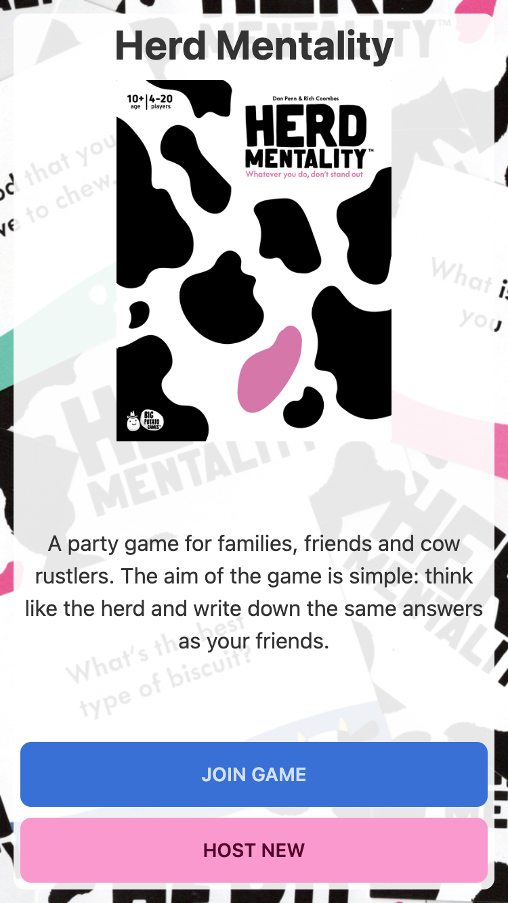
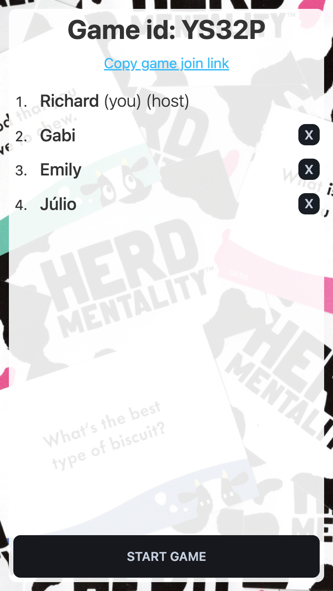
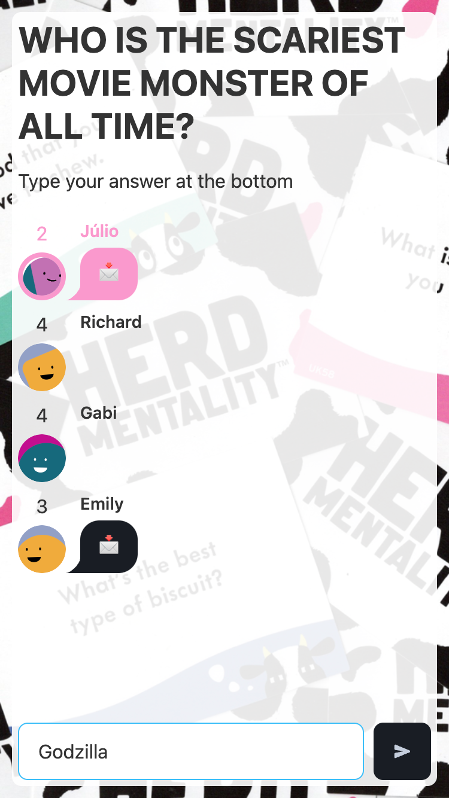
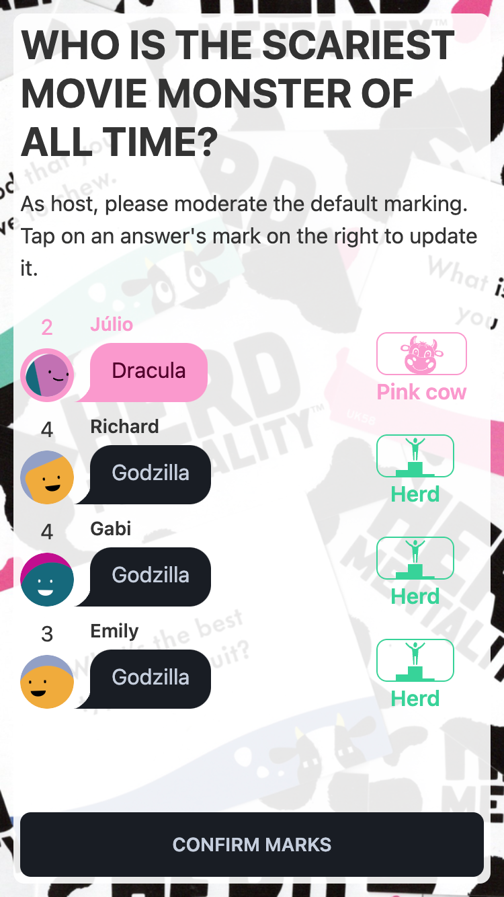

# Herd Mentality

  
  
  
  

[**Herd Mentality**](https://bigpotato.co.uk/products/herd-mentality) is a family-friendly party game that's all about _thinking like the herd_.

It is for **4-20 players**, and games take **about 20 minutes**.

## About the game

- [Background to *Herd Mentality*](/docs/WELCOME.md)
- [How to play *Herd Mentality*](/docs/RULES.md)
- [How to use this fan-made implementation](/docs/APP.md)

## About this repo

This is a multiplayer web app game, inspired by the board game of [Herd Mentality](https://bigpotato.co.uk/products/herd-mentality) as designed by [Big Potato Games](https://bigpotato.co.uk/).

It's a monorepo that uses:
- React
- Tailwind
- TypeScript
- Express
- socket.io

## Local development

1. Install monorepo dependencies (`yarn`)
2. Run front-end: `yarn dev:client`
3. Run back-end: `yarn dev:server`